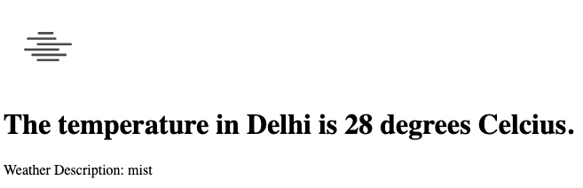
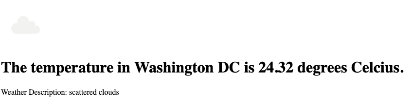

# Weather Web App

A Standard Weather WebApp using Node, Express & OpenWeatherMap API

Content
- Initialization
- Screenshots
- Explanation of the Code
- References

## Initialization
To run this project:
- Register on [OpenWeatherMap](https://openweathermap.org/), and generate an API key, and save it.
- Go to Code → Download ZIP, and extract the ZIP file or,
- Go to Terminal, and run the following command: <br>
```git clone https://github.com/abhinrustagi/Weather-Web-App.git```
- Add your API Key in the app.js file.
- Run the following command: <br> ```node app.js```

**Make sure you have node installed on your system.**

**If in case the ```node_modules``` folder is not available in your downloaded directory, go to Terminal, navigate to the folder containing the project and run ```npm install```.**

## Screenshots
**Home Screen** <br>


**Sample Query**


**Sample Query 2**


## Explanation of the Code

#### app.js
1. Lines 1 → 7: Package Imports, and Prerequisites.
2. Lines 9 → 11 <br>```app.get("/", function(req, res){ ... });```<br>
  Send the ```index.html``` file to the client side.
3. Lines 13 → 36 <br> ```app.post("/", function(req, res){ ... });```<br>
Parses the request → Makes a get request using the API Key, City Name to OpenWeatherMap. → Obtains a response in the form of JSON → Parses the JSON to obtain the Temperature, Weather Description and Image ID. → Makes a request to obtain the corresponding weather image icon using the ID. → Outputs the image, and the other details.
4. Lines 38 → <br>
Server setup on Port 3000.

## References
- [Node Documentation](https://nodejs.org/en/docs/)
- [Express Documentation](https://expressjs.com/)
- [Body Parser Documentation](https://www.npmjs.com/package/body-parser)
